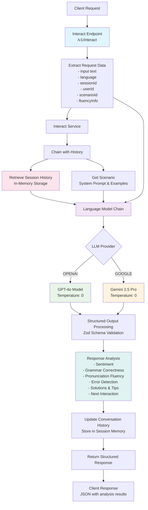

# Fluentia Server

A modern twist on "fluentia," Latin for fluency, this name reflects the goal of helping users achieve smooth, fluent communication in learning new languages.

- [Fluentia Server](#fluentia-server)
  - [Features](#features)
  - [Stack Used](#stack-used)
  - [Installation](#installation)
  - [Usage](#usage)
  - [API](#api)
    - [Interact Endpoint - AI Voice Agent](#interact-endpoint---ai-voice-agent)
  - [License](#license)
  - [Contributing](#contributing)

## Features

- Express server.
- Multiple scenarios.
- Memory capabilities.

## Stack Used

- **Node.js**: JavaScript runtime environment.
- **TypeScript**: Typed superset of JavaScript.
- **Langchain**: Language processing library.
- **OpenAI API**: For language model capabilities.
- **Google Cloud**: For additional language processing services.

## Installation

1. Clone the repository:
    ```sh
    git clone https://github.com/xavidop/fluentia-server.git
    cd fluentia-server
    ```

2. Install the dependencies:
    ```sh
    yarn install
    ```

3. Create a `.env` file in the root directory and add your OpenAI API key and Google Application credentials:
    ```env
    OPENAI_API_KEY="your-openai-api-key"
    GOOGLE_APPLICATION_CREDENTIALS=credentials.json
    LLM_PROVIDER='OPENAI'
    ```

## Usage

1. Build the project:
    ```sh
    yarn run build
    ```

2. Start the application:
    ```sh
    yarn start
    ```

3. For development, you can use:
    ```sh
    yarn run dev
    ```

## API

The API is a RESTful API that uses the following endpoints:

### Interact Endpoint - AI Voice Agent

The `/v1/interact` endpoint is the core component of our AI voice agent system that provides intelligent language learning assistance with conversation history and pronunciation analysis.



**Key Features:**
- **AI Models**: Uses OpenAI GPT-4o or Google Gemini 1.5 Pro for language processing
- **Conversation History**: Maintains session-based conversation memory using in-memory storage
- **Pronunciation Analysis**: Integrates with SpeechAce API for fluency and pronunciation scoring
- **Structured Output**: Returns comprehensive language analysis including grammar, sentiment, and learning tips
- **Multi-language Support**: Processes and responds in the user's target language
- **Scenario-based Learning**: Uses predefined learning scenarios with examples

- `POST /v1/interact`: This endpoint receives a JSON object with the following structure:
    ```json
    {
        "input": "scenario-name",
        "scenario": "scenario-name",
        "language": "text-to-process",
        "sessionId": "session-id"
    }
    ```
    The `scenario` field is a string that represents the scenario to use for processing the text. The `input` field is a string that represents the text to process. The `language` field is a string that represents the language of the text. The `sessionId` field is a string that represents the session ID.

    The response will be a JSON object with the following structure:
    ```json
    {
        "input": "scenario-name",
        "answer": "text-to-process"
    }
    ```

    The `answer` field is a string that represents the next question to ask the user.


## License

This project is licensed under the Apache License, Version 2.0. See the [LICENSE](LICENSE) file for more details.

## Contributing

Contributions are welcome! Please open an issue or submit a pull request for any changes.